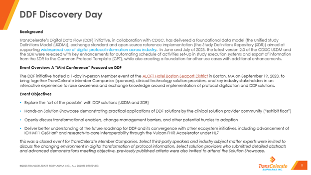

# 2023 DDF Discovery Day
September 19, 2023 - Boston, MA

TransCelerate DDF Discovery Day event brought together TransCeleraste member companies, select solution providers, CDISC and HL7 Vulcan Accelerator to discuss the industry connectivity and explore the "art of the possible" with digitalizing protocol content. Click the links below for more details on the event.

# Event Output
- [TransCelerate Blog: DDF Discovery Day – The “Art of the Possible”](https://www.transceleratebiopharmainc.com/digital-data-flow-discovery-day-the-art-of-the-possible/)
- [Summary Report: DDF Discovery Day – Exploring the “Art of the Possible”](<documents/DDF Discovery Day Readout.pdf>)
- [Presentation Materials](<documents/DDF Discovery Day_Master Slides_FINAL DISTRIBUTION.pdf>)