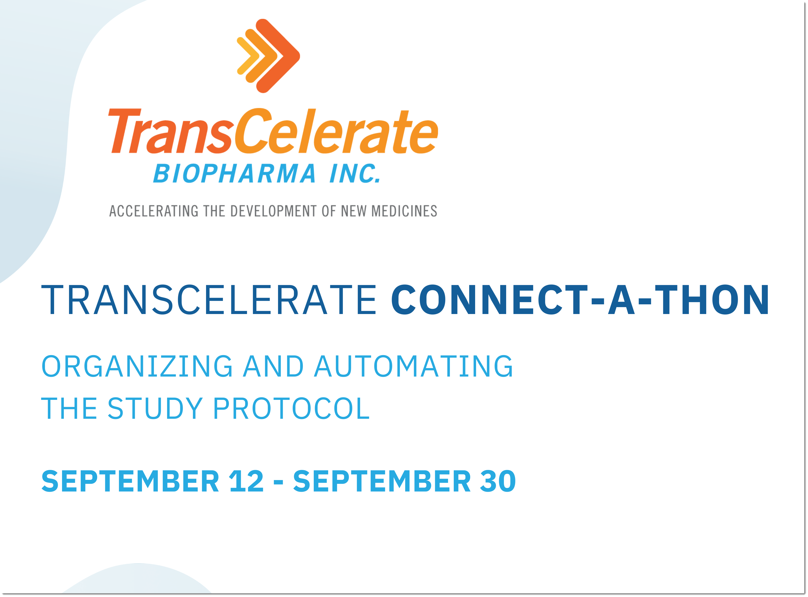

# 2022 TransCelerate DDF Connectathon

TransCelerate's DDF Initiative is hosting a virtual DDF Connectathon!

### What is the DDF Connectathon?

Click for more details

The DDF Connectathon is a virtual event for sponsor companies, life sciences technology vendors, CROs, and other stakeholders to experiment and test how well their applications align to the <b>CDISC Unified Study Definitions Model (USDM)</b> and the connectivity and interoperability of these applications with the <b>Study Definitions Repository Reference Implementation (SDR RI)</b>.

Watch a <a target="_blank" href="https://www.youtube.com/watch?v=vbq9HbhasFw">video</a> describing the DDF Connectathon.

<u>Principles of the DDF Connectathon</u>

The DDF Connectathon event focuses on practical ways that companies have and can use the SDR RI and the USDM, and is not meant to be used as an application showcase. 

A key principle of the Connectathon is that it is a safe place to explore options for connectivity, innovation, and interoperatbility. Collaboration with and across different stakeholders is highly encouraged.

### Objectives of the DDF Connectathon

Click for more details

TransCelerate's DDF Initiative is planning an exciting and inspiring event to encourage innovation and to progress DDF's objectives to faciliate interoperability across disparate systems to achieve the seamless flow of protocol data.

The DDF Connectathon strives to... 

- increase stakeholder knowledge and awareness of the DDF solution across the industry through direct and interactive engagement with a functioning SDR RI

- better plan for future SDR RI and USDM development through stakeholder stress testing and feedback on the latest release

- gather feedback from stakeholders on features that may not have been previously considered, and

- cultivate and foster a DDF open-source community through cross-industry collaborations.

### Participating in the DDF Connectathon

Click for more details

The DDF Connectathon is a cross-industry event. Participants from sponsor companies, life science technology solution vendors, CROs, and other stakeholders are welcome to participate.

<u>Benefits of Participating</u>

By participating in the DDF Connectathon, you will benefit by:

- actively demonstrating and watching others demonstrate connectivity and interoperability with stakeholder solutions

- improving the ability to align solutions with CDISC's USDM standards

- learning from and collaborating with experienced DDF experts and other Connectathon participants, and

- actively contributing toward the DDF solution's future as an early adopter.

<u>Participant Expectations</u>

This will be an interactive event. Participants will get the most out it by having:

- a functioning solution capable of integrating with the DDF Initiative standards and technology

- a dedicated team capable of setting aside 3 weeks to integrate, test, and develop a solution, and

- a collaborative and cooperative attitude, ready to work with others toward innovative protocol data exchange.

### Solution Exploration Opportunities at DDF Connectathon

Click for more details

There are six tracks across two categories.  Innovative exploration not detailed below is also welcome and encouraged. More information about tracks will be provided post-registration. 

<u>Category: Data Interoperability</u>

TRACK: Connectivity Completeness

- Of the complete set of data elements within the USDM, how many elements are you able to store and transfer (up and/or down)​

<u>Category: Solution Innovation</u>

TRACK: Analytics/Reporting

- Solution features focused on performing background analysis of relevant DDF data

TRACK: Process Automation

- Solution features related to workflow and process automations, both for input and output of the solution​

TRACK: SDR Host Migration

- Proven ability to migrate, deploy, validate and successfully connect to a hosted SDR instance on a novel system architecture​

TRACK: Supplemental Data and Additional Standards

- Solution features dedicated to layering additional data or incorporating additional standards on top of what is described with the USDM​

TRACK: User Interface (UI) / User Experience (UX)

- Solution features around displaying relevant data in an easy to use and understand format​

### [DDF Connectathon FAQ](CaT_FAQ.md)

<i>Registration is now open!</i>

