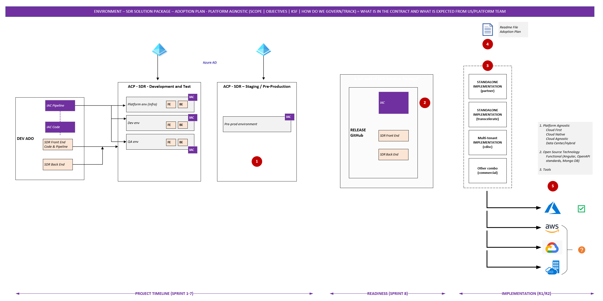
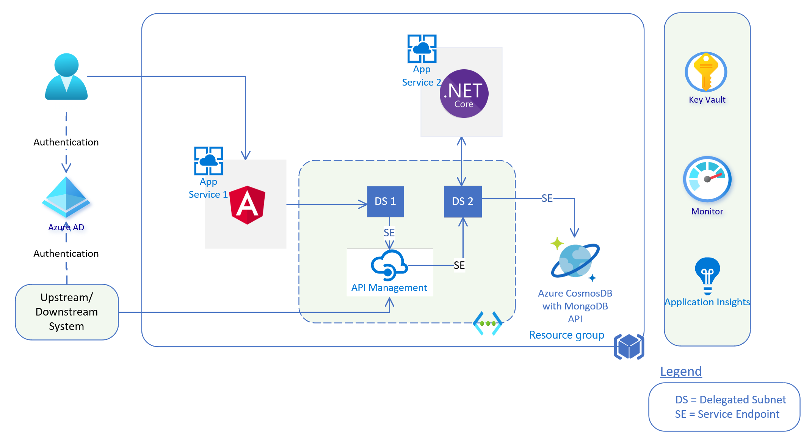
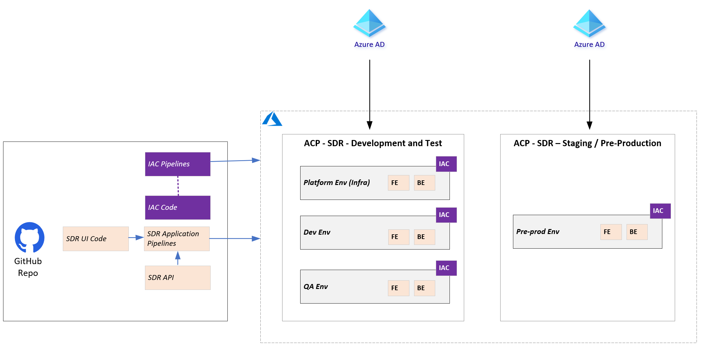
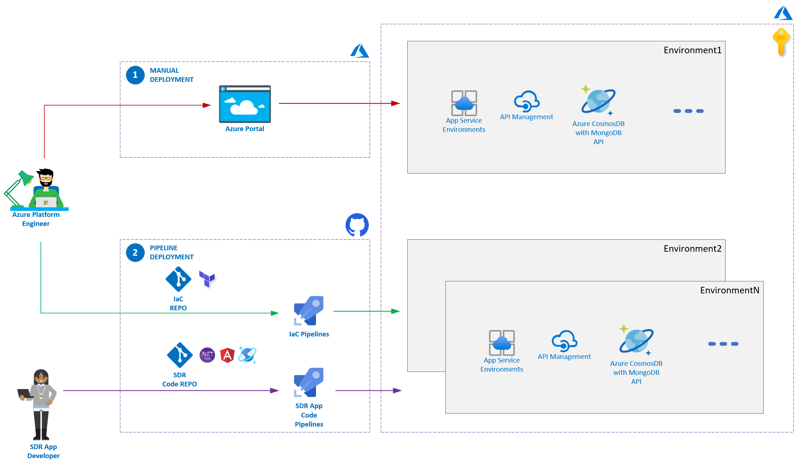
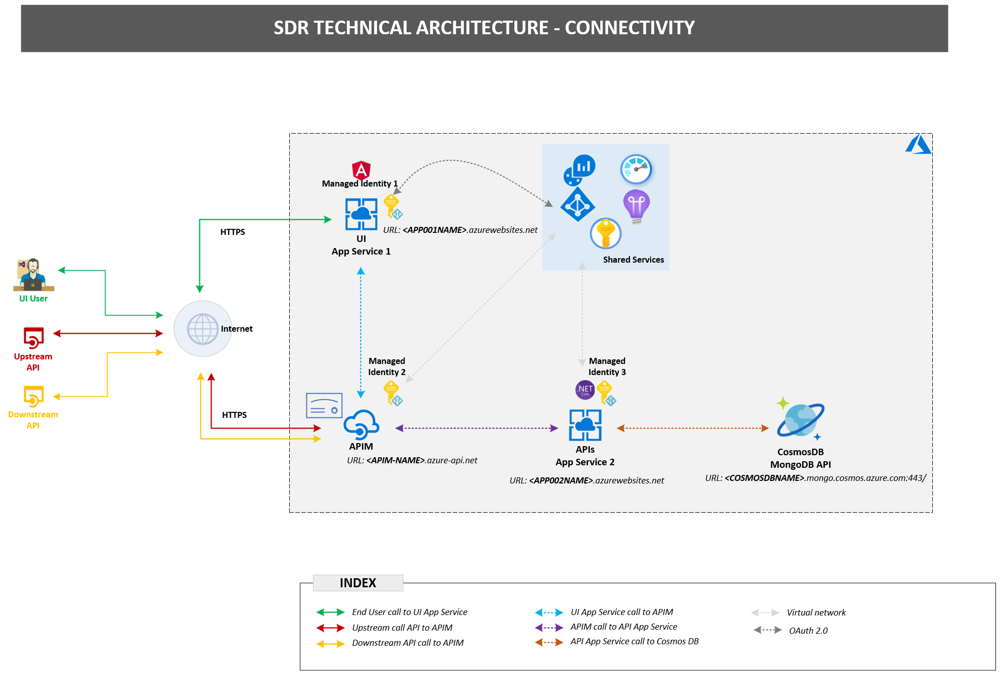
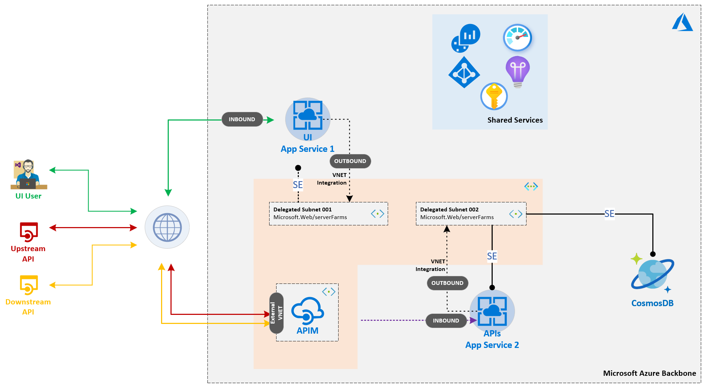
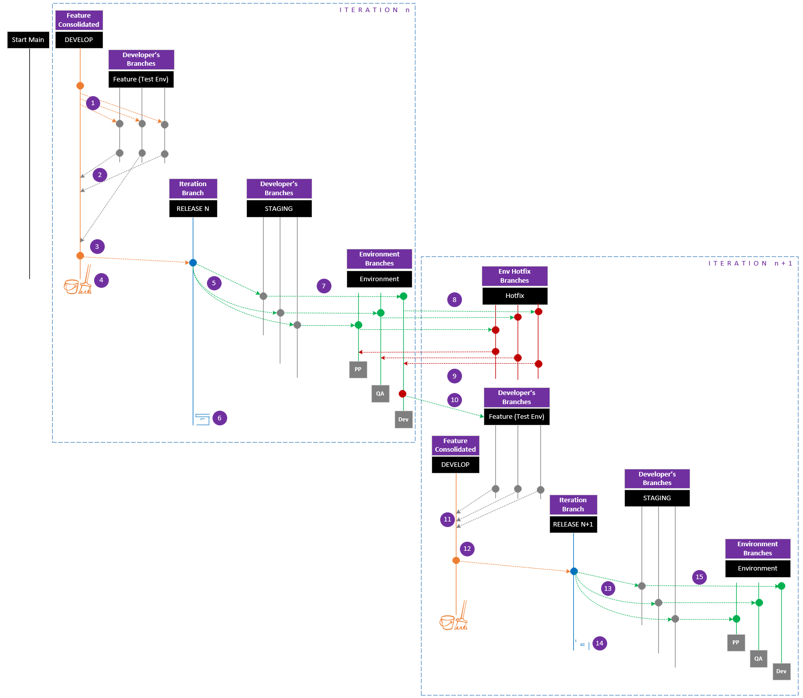
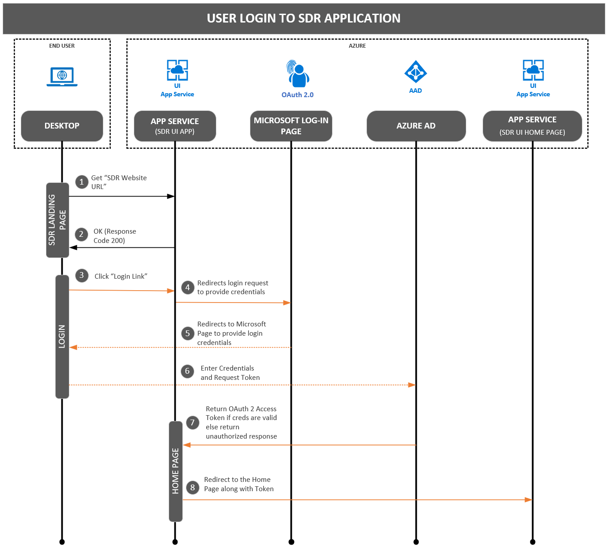
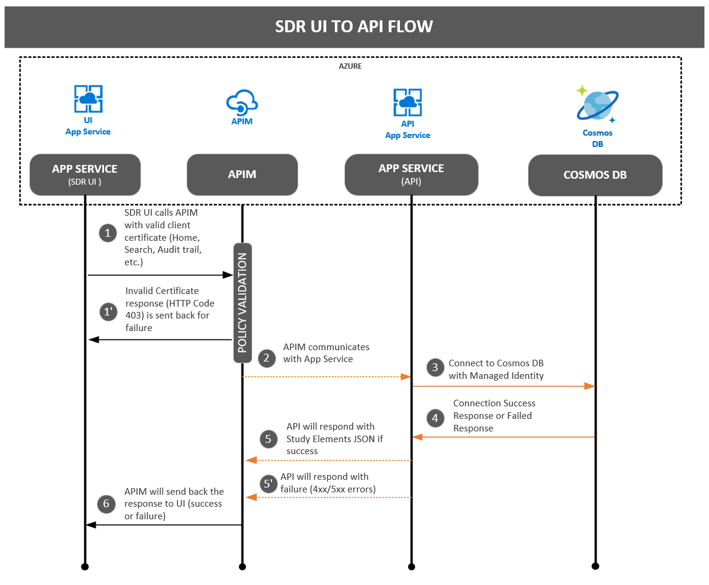
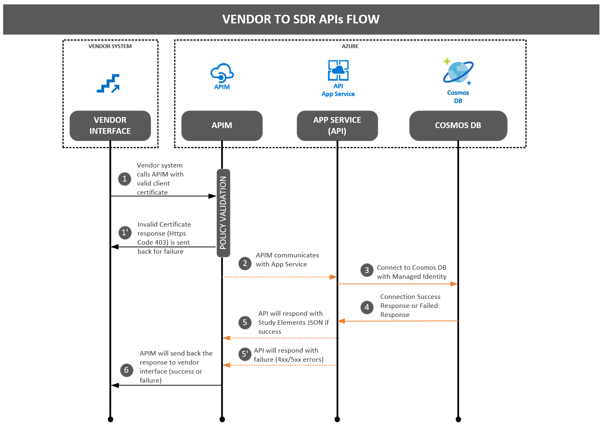

## Azure Platform Architecture

This page is a conversion of the Microsoft Vizio documentation of the Azure Platform Architecture.

|  |
|:--:|
| *SDF MVP Plan* |

|  |
|:--:|
| *Solution Architecture* |

|  |
|:--:|
| *SDR Environment Strategy* |

|  |
|:--:|
| *SDR Infrastructure as Code* |

|  |
|:--:|
| *SDR Connectivity* |

|  |
|:--:|
| *SDR Networking* |

|  |
|:--:|
| *SDR DevOps Branching Strategy* |

|  |
|:--:|
| *OAuth 2 Authentication* |

|  |
|:--:|
| *OAuth 2 Login Flow* |

|  |
|:--:|
| *OAuth 2 UI to API Flow* |

|  |
|:--:|
| *OAuth 2 Vendor to API Flow* |
