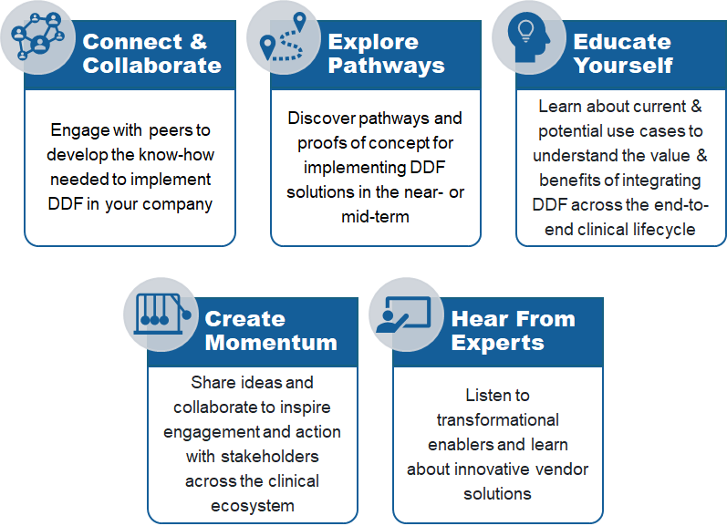

# 2024 'DDF In Action' Day

TransCelerate is having an in-person full day event: 

<strong>DDF In Action - Transforming Clinical Trials with Standards and Digitalization: Continuing the Journey, Charting the Future</strong>

## Overview
This interactive in-person experience will bring together sponsor companies, clinical solution providers, and key industry stakeholders to exchange knowledge and collaborate on implementing the Unified Study Definition Model (USDM) and Study Definitions Repository (SDR) DDF solutions. 

## Date & Locations
### Date
- Thursday, October 10th, 2024
### Locations
- <strong>EURPOE</strong>:  Hosted by Novo Nordisk in Copenhagen, Denmark
- <strong>US</strong>:  Hosted by Johnson & Johnson in New Jersey, US

## Objectives

## Participation
### Attendance Registration
Anyone interested in 'Protocol Digitization and Interoperability' may benefit from attending this event.  

Click here to register for the event. NOTE: Registration closes on XYZ, 2024.

### Abstract Submission for DDF In Action Day Poster Session
If you have developed a solution that focuses on how the USDM and/or the SDR Reference Implementation have been or can be applied to achieve protocol digitalization, you can submit an abstract for DDF in Action Day (poster session).

Click <a target="_blank" href="https://19866797.fs1.hubspotusercontent-na1.net/hubfs/19866797/DDF%20Events_Abstract%20Submission%20for%20Protocol%20Digitalization_v.pdf">here</a> to learn more. NOTE: Abstract submission closes on July 19th, 2024.
