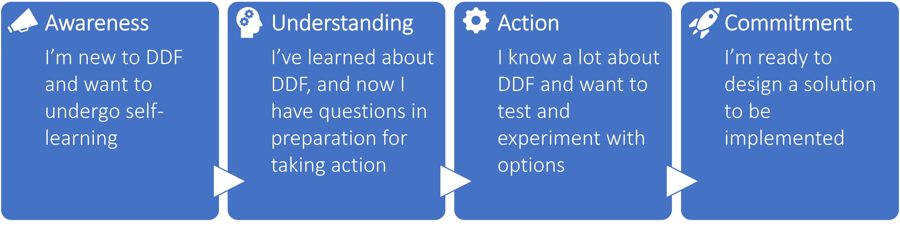

# Getting Started on DDF
TransCelerate has developed guidance for implementing DDF Solutions.  Depending on a person's role in an organization and level of understanding of DDF, they can reference different starting points.  

  
  
  
  
  

If you are already familiar with DDF and want to dive right in, click [Tools & Resources](tools.md) for more details.
