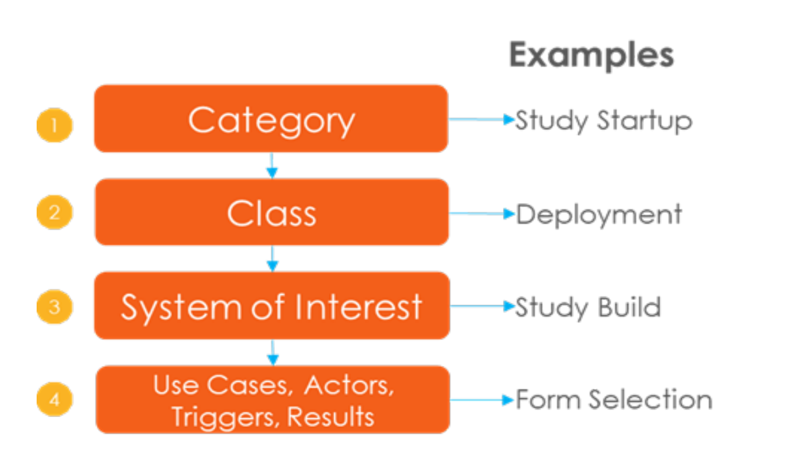
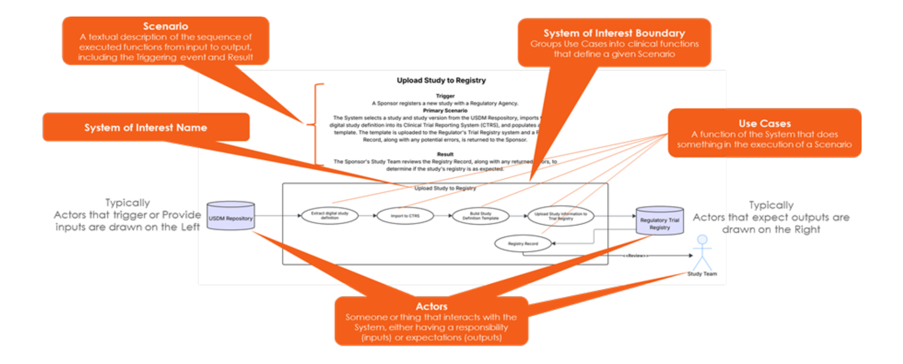

# Welcome to the Digital Study Design Use Case Library

The Library is a curated collection of potential use cases developed as part of the Transcelerate Digital Data Flow (DDF) initiative. It is a living resource intended to evolve as new capabilities, standards, and regulatory guidance emerge. Feedback and contributions are welcome to ensure it remains relevant and practical.

The Library strives to establish a shared understanding of the scope and benefits of Digital Study Design adoption through:
- Providing a Rosetta Stone of definition and taxonomy for sharing Digital Study Design concepts between stakeholders, and by
- Postulating a vision -- not necessarily The Vision -- of what Done looks like when USDM-compliant Digital Study Design is adopted across the clinical research ecosystem.

The Library leverages the UML Use Case format to capture proposed schemas for a Product or System of Interest by telling a story about how users interact with it to accomplish something. Each System of Interest describes the expected behavior (the What) but not the method or technologies needed to bring the expected behavior about (the How). The intent is to aid designers in understanding the System of Interest from the end user's perspective by specifying all externally visible behavior.

The Library organizes its contents into a four-level hierarchy. Each level aggregates – i.e. “contains”-- elements of subsequent levels. Specific use cases are addressed by their full hierarchy  name. For Example: Study Startup: Deployment: Study Build: Form Selection

Each System of Interest is composed of five distinct elements:
- Name: identifier for the unique collection of Use Case elements,
- Scenario: a textual description of how the system initiates, what happens once initiated, and the resulting effect,
- Boundary: visually groups the use case elements into functions that define the Scenario,
- Use Cases: the fundamental actions that occur to produce the intended result from triggering the System of Interest, and
- Actors: the entities that interact with the System of Interest, either providing inputs or receiving outputs.

The diagram below depicts the five elements within the System of Interest context.

## Accessing the Library
There are several ways to access the DDF Use Cases Library.  

<a target="_blank" href="documents/use-cases/DDF_Use_Cases.xlsx">Excel Download of the Full Library Document</a>.  

To access specific sections of the use cases individually, please click on the applicable links below.
<a target="_blank" href="">Term Glossary</a>.

### Category: Protocol Store
| Class                                                                                                                                                                               | System of Interest                                                                                  |Description                                                                                                             |
|----------------------------------------------------------------------------------------------------------------------------------------------------------------------------------------------------|-----------------------------------------------------------------------------------------------------|------------------------------------------------------------------------------------------------------------------------|
| [Past Protocols](https://github.com/transcelerate/ddf-home/blob/main/documents/USDM/USDM_RA_v1.0_(Draft).zip) | Update Protocol Store | Copy recently approved study protocol from the SDR to the Protocol Store |

### Category: Study-Experimental Concept
| Class                                                                                                                                                                               | System of Interest                                                                                  |Description                                                                                                             |
|----------------------------------------------------------------------------------------------------------------------------------------------------------------------------------------------------|-----------------------------------------------------------------------------------------------------|------------------------------------------------------------------------------------------------------------------------|
| [Past Protocols](https://github.com/transcelerate/ddf-home/blob/main/documents/USDM/USDM_RA_v1.0_(Draft).zip) | Update Protocol Store | Copy recently approved study protocol from the SDR to the Protocol Store |
| [Analytics](https://github.com/transcelerate/ddf-home/blob/main/documents/USDM/USDM_RA_v1.0_(Draft).zip) | Optimization Scores | Calculate scores that characterize anticipated technical success of a new study |
| [Analytics](https://github.com/transcelerate/ddf-home/blob/main/documents/USDM/USDM_RA_v1.0_(Draft).zip) | Enrollment Forecasting | Forecast patient enrollment rates based on past studies |
| [Analytics](https://github.com/transcelerate/ddf-home/blob/main/documents/USDM/USDM_RA_v1.0_(Draft).zip) | Resourcing and Cost Predictions | Predict the resource utilization needs of a new study |
| [Analytics](https://github.com/transcelerate/ddf-home/blob/main/documents/USDM/USDM_RA_v1.0_(Draft).zip) | Country and Site Selection | Optimize selection of study site types and locations based upon previous studies |
| [Analytics](https://github.com/transcelerate/ddf-home/blob/main/documents/USDM/USDM_RA_v1.0_(Draft).zip) | Timeline Forecasting | Forecast ranges for key study timeline milestones |
| [Study Design](https://github.com/transcelerate/ddf-home/blob/main/documents/USDM/USDM_RA_v1.0_(Draft).zip) | Design Study | Populate and refine the study design elements (e.g. SOA, Estimand, Inclusion/Exclusion) |
| [Protocol Authoring](https://github.com/transcelerate/ddf-home/blob/main/documents/USDM/USDM_RA_v1.0_(Draft).zip) | Author Protocol | Use study design elements to draft the study protocol |
| [Stakeholder Views](https://github.com/transcelerate/ddf-home/blob/main/documents/USDM/USDM_RA_v1.0_(Draft).zip) | Render Stakeholder View | Provide a view of a study protocol customized for one of several user archetypes |

## Please Note:​
The work presented here details common elements and examples of factors that organizations may encounter when initiating a Digital Study Design/Digital Data Flow transformation. It is not intended to outline the only possibilities for achieving scalable Digital Study Design and does not constitute a recommendation to adopt or approve a particular system or  systems with particular elements or features.
 ​

Each organization must decide for itself if different, alternate approaches may work better for its unique circumstances.​ The decision to consider and to proceed with a Digital Study Design/Digital Data Flow trans-formative effort is the sole prerogative and at the complete discretion of individual organizations as informed by their internal strategies, assessments, and approval processes.

## **Comments for the Use Cases**
If you have any feedback, questions, and/or comments for the use cases, please follow the instructions below.

<a target="_blank" href="https://www.transceleratebiopharmainc.com/assets/digital-data-flow-feedback-form/">Click here to submit your feedback</a>.  
