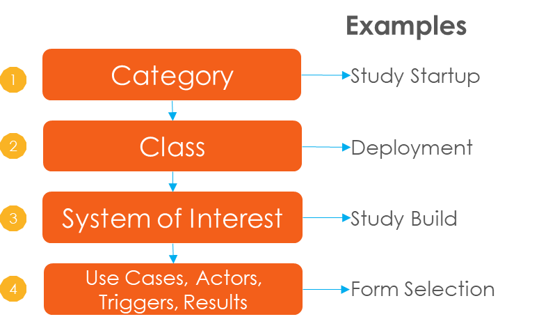
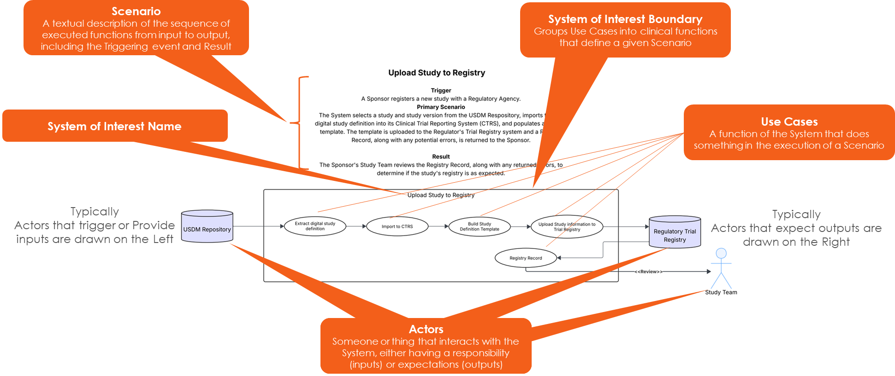

# Welcome to the Digital Study Design Use Case Library

The Library is a curated collection of potential use cases developed as part of the Transcelerate Digital Data Flow (DDF) initiative. It is a living resource intended to evolve as new capabilities, standards, and regulatory guidance emerge. Feedback and contributions are welcome to ensure it remains relevant and practical.

The Library strives to establish a shared understanding of the scope and benefits of Digital Study Design adoption through:
- Providing a Rosetta Stone of definition and taxonomy for sharing Digital Study Design concepts between stakeholders, and by
- Postulating a vision -- not necessarily The Vision -- of what Done looks like when USDM-compliant Digital Study Design is adopted across the clinical research ecosystem.

The Library leverages the UML Use Case format to capture proposed schemas for a Product or System of Interest by telling a story about how users interact with it to accomplish something. Each System of Interest describes the expected behavior (the What) but not the method or technologies needed to bring the expected behavior about (the How). The intent is to aid designers in understanding the System of Interest from the end user's perspective by specifying all externally visible behavior.

The Library organizes its contents into a four-level hierarchy. Each level aggregates – i.e. “contains”-- elements of subsequent levels. Specific 
use cases are addressed by their full hierarchy name.  

For Example:  Study Startup: Deployment: Study Build: Form Selection

Each System of Interest is composed of five distinct elements:
- NAME: identifier for the unique collection of Use Case elements,
- SCENARIO: a textual description of how the system initiates, what happens once initiated, and the resulting effect,
- BOUNDARY: visually groups the use case elements into functions that define the Scenario,
- USE CASES: the fundamental actions that occur to produce the intended result from triggering the System of Interest, and
- ACTORS: the entities that interact with the System of Interest, either providing inputs or receiving outputs.

The diagram below depicts the five elements within the System of Interest context:

Please Note:
1. The Library details sample elements and examples of factors that organizations may encounter when initiating a Digital Study Design/Digital Data Flow transformation. Each 
organization must decide for itself if different, alternate approaches may work better for its unique circumstances.
2. This Use Case Library is not intended as an endorsement of or a recommendation to adopt any particular technology, product, or platform.
3. This Version of the Use Case Library has been published to provide stakeholders with a chance to evaluate the Use Cases and related concepts set out herein and to provide feedback on how to improve and evolve these and other Use Cases and the related content. TransCelerate will publish an updated version of the Use Case Library as soon as 
reasonably practicable after compiling and incorporated anticipated feedback from interested stakeholders.

## Feedback for the Use Cases
Feedback and contributions are welcome to ensure it remains relevant and practical. Please click on the link below and leverage the form to submit your feedback.

<a target="_blank" href="https://www.transceleratebiopharmainc.com/assets/digital-data-flow-feedback-form/">Click here to submit your feedback</a>.  

## Accessing the Library
There are several ways to access the DDF Use Cases Library: (1) Excel Download or (2) Specific Sections via PDF. 

To easily access the terms and glossary for the library, please click <a target="_blank" href="documents/use-cases/DDF_Use_Cases_Glossary">here.</a>

### 1. Excel Download
<a target="_blank" href="documents/use-cases/DDF_Use_Cases_FEB2026.xlsx">Excel Download of the Full Library Document</a>.  

### 2. PDF of Specific Sections
To access specific sections of the use cases individually, please click on the applicable links below.

#### CATEGORY:  PROTOCOL STORE

| Class | System of Interest | Description |
|-------|--------------------|-------------|
| [Past Protocols](https://github.com/transcelerate/ddf-home/blob/main/documents/USDM/USDM_RA_v1.0_(Draft).zip) | Update Protocol Store | Copy recently approved study protocol from the SDR to the Protocol Store |

#### CATEGORY: STUDY-EXPERIMENTAL CONCEPT

| Class | System of Interest | Description |
|-------|--------------------|-------------|
| [Past Protocols](https://github.com/transcelerate/ddf-home/blob/main/documents/USDM/USDM_RA_v1.0_(Draft).zip) | Update Protocol Store | Copy recently approved study protocol from the SDR to the Protocol Store |
| [Analytics](https://github.com/transcelerate/ddf-home/blob/main/documents/USDM/USDM_RA_v1.0_(Draft).zip) | Optimization Scores | Calculate scores that characterize anticipated technical success of a new study |
| | Enrollment Forecasting | Forecast patient enrollment rates based on past studies |
|  | Resourcing and Cost Predictions | Predict the resource utilization needs of a new study |
|  | Country and Site Selection | Optimize selection of study site types and locations based upon previous studies |
|  | Timeline Forecasting | Forecast ranges for key study timeline milestones |
| [Study Design](https://github.com/transcelerate/ddf-home/blob/main/documents/USDM/USDM_RA_v1.0_(Draft).zip) | Design Study | Populate and refine the study design elements (e.g. SOA, Estimand, Inclusion/Exclusion) |
| [Protocol Authoring](https://github.com/transcelerate/ddf-home/blob/main/documents/USDM/USDM_RA_v1.0_(Draft).zip) | Author Protocol | Use study design elements to draft the study protocol |
| [Stakeholder Views](https://github.com/transcelerate/ddf-home/blob/main/documents/USDM/USDM_RA_v1.0_(Draft).zip) | Render Stakeholder View | Provide a view of a study protocol customized for one of several user archetypes |

#### CATEGORY: STUDY STARTUP

| Class | System of Interest | Description |
|-------|--------------------|-------------|
| [Deployment](https://github.com/transcelerate/ddf-home/blob/main/documents/USDM/USDM_RA_v1.0_(Draft).zip) | Study Build | Configure data collection platforms for patient and site use. |
| | Central Analysis Services | Draft requests for study analytical services and use supplier responses to configure QC |
|  | Clinical Trial Materials | Forecast clinical trial material needs -- i.e. study drug -- as a function of study timeline. |
|  | Interactive Response Technology | Configure interactive platforms for use in the study |
|  | Clinical Trial Management | Configure Clinical Trial Management Systems |
| [Trial Budgets](https://github.com/transcelerate/ddf-home/blob/main/documents/USDM/USDM_RA_v1.0_(Draft).zip) | Draft Study Budget | Create an initial budget for a new study |
|  | Draft Site-Level Budget | Create site-level budgets for investigator grants |
| [Trial Registries](https://github.com/transcelerate/ddf-home/blob/main/documents/USDM/USDM_RA_v1.0_(Draft).zip) | Upload Study to Registry | Report a new study to regulatory trial registries |

#### CATEGORY: STUDY EXECUTION

| Class | System of Interest | Description |
|-------|--------------------|-------------|
| [Amendments](https://github.com/transcelerate/ddf-home/blob/main/documents/USDM/USDM_RA_v1.0_(Draft).zip) | Report Protocol Changes | Compute changes in study protocol versions and transmit to interested parties |
| [Drug and Materials](https://github.com/transcelerate/ddf-home/blob/main/documents/USDM/USDM_RA_v1.0_(Draft).zip) | Estimate Trial Site Inventory Needs | Apply the study timeline to incoming site data to estimate their trial material inventories and future needs |
| [Patient Recruitment](https://github.com/transcelerate/ddf-home/blob/main/documents/USDM/USDM_RA_v1.0_(Draft).zip) | Query Patient Screening Facilities for Potential Study-Subjects | Transmit study Inclusion/Exclusion criteria to Patient Screening Facilities and receive patient population estimates |
| [Site Support](https://github.com/transcelerate/ddf-home/blob/main/documents/USDM/USDM_RA_v1.0_(Draft).zip) | Populate Trial Site Data Systems | Transmit study design element information (e.g. SOA) to trial site data systems |
| [Site Monitoring](https://github.com/transcelerate/ddf-home/blob/main/documents/USDM/USDM_RA_v1.0_(Draft).zip) | Verify Site Compliance | Compare study protocol treatment progression to  incoming trial site data to find potential deviations |

